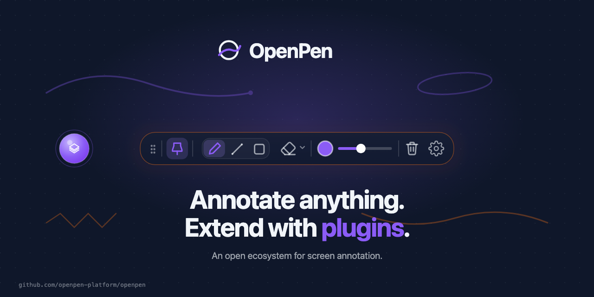
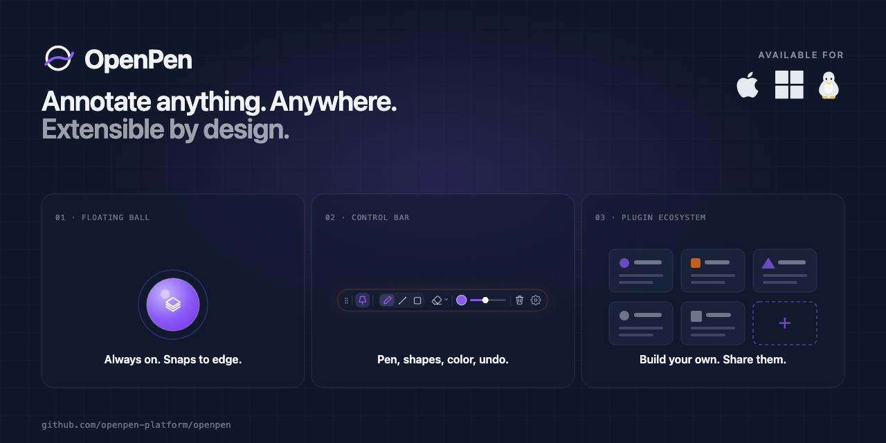

# OpenPen

Draw on your screen without leaving your app.

An extensible overlay where every tool — built-in or third-party — is just a plugin.
We're building OpenPen as a community-shaped product: the canvas ships with a useful default
set, and the ecosystem grows by anyone with an idea.




## Who it's for

OpenPen is built for anyone who shares their screen and needs to point things out clearly —
without alt-tabbing to a separate annotation tool or leaving the app they're presenting.

- **Presenters & educators** — highlight UI elements during live demos, workshops, or online classes
- **Streamers & content creators** — add visual emphasis to walkthroughs and tutorials in real time
- **Developers & designers** — annotate during code reviews, design critiques, and pair-programming
- **Remote teams** — make screen-share meetings more interactive and easier to follow

It stays out of the way as a floating ball until you need it, and disappears the moment you don't.

## Features

- Overlays a transparent drawing canvas above any app, including full-screen windows
- Switches between freehand, line, and shape tools (rectangle / ellipse)
- Adjusts stroke width and color, with a gradient highlight mode
- Collapses to a floating ball that snaps to the screen edge when dragged
- Plugin-first architecture — third-party plugins use the same contract, slots, and runtime APIs as the built-in modules; the built-in drawing tools are themselves plugins, not a privileged core

  

## Install

> **Release artifacts are being prepared.** Pre-built binaries will be
> available on [GitHub Releases](https://github.com/openpen-platform/openpen/releases)
> once the v1.0.0 milestone is cut.

In the meantime, build from source — see [Building](#building) below.

See [Platform support](#platform-support) for per-platform status.

## Documentation

Full guides and API reference live in [`docs/README.md`](./docs/README.md).

## Plugins

OpenPen uses a four-layer plugin-host architecture (core / host chrome / UIKit / modules).
Built-in tools and third-party plugins share the same `OpenPenModule` contract and contribute
to the same slots (`controlBar`, `settingsTabs`, `shortcuts`, and more).

**Build your first plugin in 5 minutes** →
[Tutorial](docs/tutorials/build-your-first-plugin.md) ·
[Module Architecture](docs/concepts/module-architecture.md) ·
[Slot Reference](docs/reference/slots.md)

```bash
npx degit openpen/plugin-starter my-plugin
```

**Security**: OpenPen uses a user-installed trust model — plugins run with full host access.
**Before installing any plugin, evaluate the source yourself.** See
[Trust Model](docs/concepts/trust-model.md) and [`SECURITY.md`](SECURITY.md) for baseline
protections and the audit log.

## Platform support

| Platform | Status |
| -------- | ------ |
| macOS    | Supported |
| Windows  | Supported |
| Linux    | Launches, but overlay layering breaks in draw mode — fix in progress |

## Localization

OpenPen ships with a built-in language switcher. The UI is fully translated for the
following locales:

| Language | Locale | Status |
| -------- | ------ | ------ |
| English | `en` | ✅ Complete |
| 繁體中文 (Traditional Chinese) | `zh-Hant` | ✅ Complete |
| 简体中文 (Simplified Chinese) | `zh-Hans` | ✅ Complete |
| 日本語 (Japanese) | `ja` | ✅ Complete |

The app auto-detects your system language on first launch and falls back to English if the
locale is not yet supported. You can change the language at any time from **Settings → General**.

**Want to see your language here?** Speakers of any language are warmly welcome:

- **Request** — open an [issue](https://github.com/openpen-platform/openpen/issues) to let us know which language you'd like
- **Contribute** — copy [`src/i18n/en.ts`](./src/i18n/en.ts), name the file after its [BCP 47](https://www.iana.org/assignments/language-subtag-registry) tag (e.g. `fr.ts`), register it in `src/i18n/index.ts`, and open a pull request

## Development

```bash
npm install
npm run dev          # Vite + Electron
npm run test:unit    # unit tests (Vitest)
npx playwright test  # e2e tests (Playwright + Electron)
npm run build        # production Vite build
```

DevTools open by default in dev mode. Runtime config lives in [`app.config.js`](./app.config.js).

## Building

```bash
npm run dist:mac     # macOS .dmg  (arm64 + x64)
npm run dist:win     # Windows .exe installer  (x64 + arm64)
npm run dist:linux   # Linux .AppImage  (x64 + arm64)
```

Output lands in `release/`. For artifact naming, code signing, entitlements,
and CI setup, see [`docs/guides/building.md`](./docs/guides/building.md).

## Contributing & feedback

OpenPen is in its early days and very much shaped by the people who use it.
Whether you've got a feature idea, ran into a bug, want to build a plugin,
or just have thoughts on how things could work better — issues, discussions,
and pull requests are all genuinely welcome. No suggestion is too small.

See [`CONTRIBUTING.md`](./CONTRIBUTING.md) for development setup and coding conventions.

## License

OpenPen uses a **layered license model** to balance copyleft protection
of the host with plugin ecosystem freedom:

| Component | License | Notes |
|-----------|---------|-------|
| OpenPen host application | [GPL-3.0-or-later](LICENSE) **+ Linking Exception** | Modifications to OpenPen itself remain GPL-3.0-or-later. Plugins linked through the official `@openpen/module-api` SDK may use any license. |
| `@openpen/module-api` | [MIT](packages/module-api/LICENSE) | Plugin SDK — depend on it under any license, including proprietary. |
| `@openpen/build` | [MIT](packages/build-cli/LICENSE) | Plugin build CLI. |
| `openpen-cli` | [MIT](packages/openpen-cli/LICENSE) | Plugin install CLI. |

**What this means:**
- ✅ You can write closed-source / commercial plugins for OpenPen.
- ✅ You can sell plugins under any license you choose.
- ❌ You cannot fork OpenPen, rename it, and sell the modified host as
  a closed-source product. Modifications to OpenPen itself remain GPL-3.0-or-later.

See [`LICENSE`](LICENSE) for the full GPL-3.0-or-later text and the Linking
Exception clause.

**Clarifications:**

- **Dynamic vs static linking** — plugins built through the official
  `@openpen/build` CLI are dynamically linked against OpenPen at runtime
  via the importmap mechanism. Whether a plugin is bundled, transpiled,
  minified, or distributed as separate files does not affect the Linking
  Exception — what matters is that the plugin uses the public
  `@openpen/module-api` SDK surface.

- **Copying source code from the OpenPen host** — the host application
  itself (`src/`, `electron/`) is GPL-3.0-or-later. If a plugin **copies** code
  from these directories (rather than importing through the SDK), the
  plugin includes GPL-3.0-or-later code and must itself be GPL-3.0-or-later as a derivative
  work. This is GPL's standard derivative-work clause, not an OpenPen-
  specific rule.

- **UIKit components are MIT** — the `@openpen/module-api/uikit`
  wrappers (`AppPopover`, `AppDialog`, `AppSlider`, etc.) are part
  of the MIT-licensed SDK package. You may copy, modify, and redistribute
  them in your plugin under any license you choose.

- **Redistributing OpenPen host** — if you redistribute the OpenPen
  application itself (modified or unmodified, e.g. shipping an Electron
  build to end users), you must comply with GPL obligations: provide
  source code, preserve license notices, and include the `LICENSE` file.
  The MIT-licensed SDK packages do not exempt redistributors of the
  host from these GPL obligations.

© 2025-2026 OpenPen
